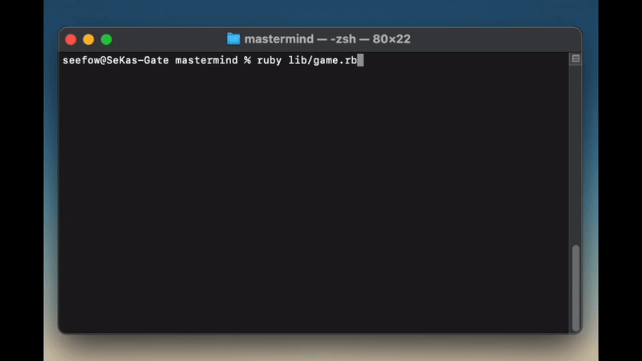

<h2 align="center"><u>Mastermind</u></h2>



<p align="center">
<br>
</p>

## Table of Contents
+ [Overview](#overview)
+ [How It's Made](#how_its_made)
+ [Usage](#usage)
+ [Gameplay](#gameplay)

## Overview <a name = "overview"></a>

This program is from a project within the Ruby path of The Odin Project called [Mastermind](https://www.theodinproject.com/lessons/ruby-mastermind) which is the second and final project of the Object Oriented Programming lesson. This project will further enhance my skills in OOP principles. The game will be played vs. the computer and will allow the computer to guess the user's code, or will allow the user to guess the computer's randomly generated code. 

## How It's Made <a name = "how_its_made"></a>

**Tech used:** Ruby

The game was written in Ruby. It is CLI based so game will only run on there or on replit. Computer utilizes [Swaszek strategy](https://puzzling.stackexchange.com/a/8884).

## Usage: <a name = "usage"></a>

To play it on CLI, you mut have ruby installed on your system, clone this repo, then from CLI cd into the lib directory and type ```ruby game.rb```  and press enter.

To play it on replit, click [here](https://replit.com/@DreamVenerable/HotSeveralNetframework). Then type ```ruby lib/game.rb``` and press enter.

## Gameplay <a name = "gameplay"></a>

#### Setup
There is a code maker and a code breaker. The code maker is responsible to create a code with four numbers. The code maker can only choose a number between 1 and 6, duplicates allowed. Hints will be given in form or two letters, R and W, in random order. 

##### Code Maker

Once you've made decisions on how the game will be established, you may begin play. The code maker will establish a code based upon the previously agreed upon rules of the game using four numbers. Once the code is established, it is not allowed to be changed and must be hidden from the code breaker. As the code breaker makes their guess/es, the code maker will utilize the four small pegs to give the code breaker clues in response to their guess. 

If a code breaker guesses the right color and location, the code maker will put a red colored peg for each correct color and position. If the code breaker guessed the right color but wrong location, the code maker will utilize a white peg to indicate this. 

##### Code Breaker

The code breaker's job is to guess the correct pattern for both number and order of the code makers code. After each guess, if there are correct numbers or positions or both on the board, the code maker will utilize the correct color pegs to indicate this. 

##### Example
The code maker chooses **1-1-2-2** and the code breaker guesses **1-1-1-2** the code maker will award two red-colored pegs for the first two numbers and one red peg for the last number guess, or "R, R, W". 

Taking that example a step further let's say the code make chose **1-1-2-2** and the code breaker chose **2-1-1-1**, the code maker would then provide a two white pegs, one for the number 2, and one for the number 1, and one red-colored peg for the second number, or "W, R, W".

Once the feedback is provided, the code breaker will use that information to then re-form another guess and try to narrow the results down. It will continue in this manner until one of two conditions are met:

- The number of rounds have ended
- The code breaker guessed the correct code
